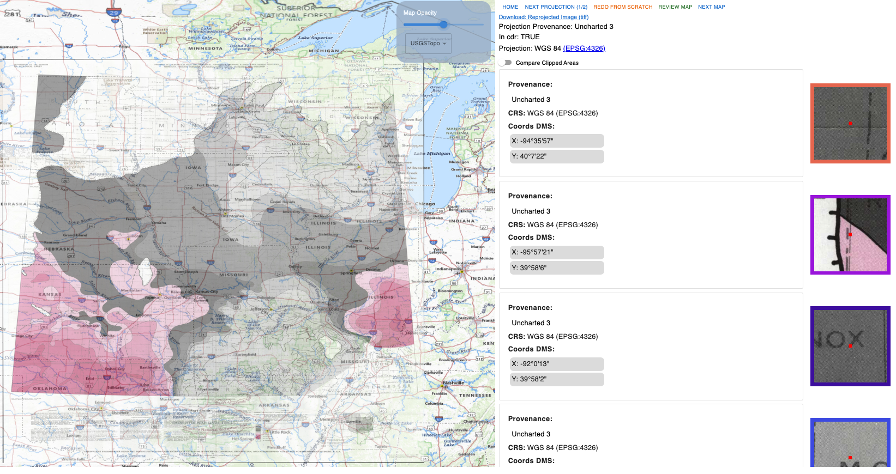
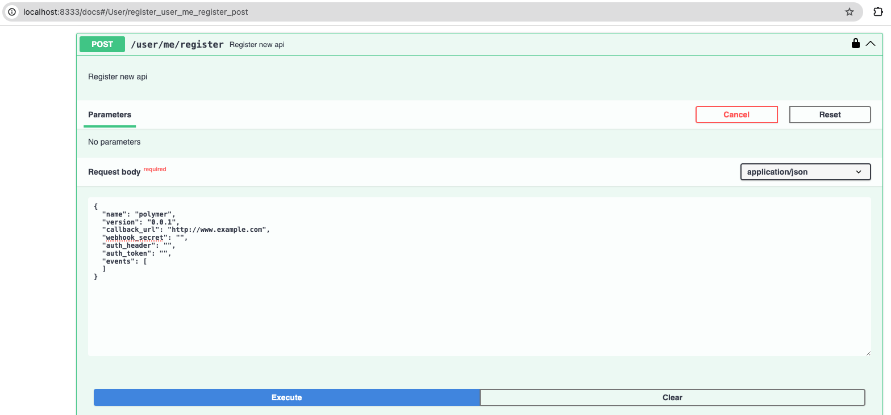

# Polymer

This project is Jataware's offerning to DARPA's CriticalMAAS AIE as a Human Machine Interface (HMI) and associated services to allow users to find, annotate, and/or correct map digitizations (TA2) and find, view, and annotate reports relevant to Critical Mineral Assessments (CMA).



# Architecture


## Install Requirements

- Poetry [https://python-poetry.org/]
- Python 3.12 environment
- NPM (Tested with 8.17.0)
- Docker
- Docker Compose
- make
- Get a free MapTiler key at https://www.maptiler.com/
- Create an OPENAPI token and ask to get it asssociated with the Jataware group.

## Configuration

### Polymer Service Layer (FastAPI)

Polymer assumes a running CriticalMAAS Data Repository (CDR) to connect to map data. You must therefore register two services with the CDR to get Polymer working correctly. Please see https://github.com/jataware/cdr first before installing this project.

**Polymer HMI** (This is used for the user pushing validated map results to the CDR)

```
system: polymer
system_version: 0.0.1
```

For this one you'll want to use the following JSON:

```
{
  "name": "polymer",
  "version": "0.0.1",
  "callback_url": "http://localhost:3001/",
  "webhook_secret": "",
  "auth_header": "",
  "auth_token": "",
  "events": [
  ]
}
```

**Jataware Georeferencer** (This is Jataware's Georeferencer Service that take requests from the CDR to georeference maps, and submits results on demand.)

```
system: jataware_georef
system_version: 0.1.0
```

For this one you'll want to use the following JSON:

```
{
    "name": "jataware_georef",
    "version": "0.1.0",
    "callback_url": "http://localhost:3001/map/project",
    "webhook_secret": "",
    "auth_header": "",
    "auth_token": "",
    "events": [
        "map.process"
    ]
}
```

For the CDR instructions at https://github.com/jataware/cdr?tab=readme-ov-file#creation-of-users-tokens-assignment-of-roles to register both pair of systems above by first creating a user, user token, and giving your tokens the appropriate roles, and then register your systems via the CDR API's using your token.



## Build and Run For Development (via Docker Containers)

Build Polymer API Service layer

`make docker-build-georef`

Build Jataware Georeferencer

`make docker-build-jataware-georef`

Build Polymer HMI

`make docker-build-maps-ui`

## Build and Run For Development (Locally)

### Polymer API

 ### TODO tesseract-ocr dependency
 ### common.polymer.rocks bucket missing + public permission

Setup AWS profile

Modify `~/.aws/credentials` add the following profile.

Make sure your shell does not have
`AWS_ACCESS_KEY_ID` `AWS_SECRET_ACCESS_KEY` already in the environment.
```

[minio]
aws_access_key_id = miniouser
aws_secret_access_key = miniopass

```

Setup `services/auto-georef/.env`

```
AUTOGEOREF_OPEN_AI_KEY="sk-lksjdlfkjalsjdflkakjsdf"
AUTOGEOREF_CDR_BEARER_TOKEN="Bearer ce749b92d78546bad1680fd2583ecfa9a5b9d1fe2d184f6ef805ce3717da1128"
AUTOGEOREF_cdr_s3_endpoint_url="http://localhost:9000"
AUTOGEOREF_cdr_es_endpoint_url="http://localhost:9200"
AUTOGEOREF_cdr_endpoint_url="http://localhost:8333"
AUTOGEOREF_polymer_es_endpoint_url="http://localhost:9200"
AUTOGEOREF_polymer_s3_endpoint_url="http://localhost:9000"
AUTOGEOREF_polymer_public_bucket="common.polymer.rocks"

AWS_PROFILE=minio
CPL_CURL_VERBOSE=1
```

Install and Start Polymer API

```

cd services/auto-georef
poetry install
AWS_PROFILE=minio poetry run dev

```

Verify: http://0.0.0.0:3000/docs

### Create Minio/S3 Bucket needed for Polymer

```
cd services/auto-georef
AWS_PROFILE=minio poetry run python -m auto_georef.cli.buckets
```

### Create Polymer Elasticsearch Indices

```
cd services/auto-georef
poetry run python -m auto_georef.cli.create_es_index
```

### Maps UI

Create an `maps_ui/.env`

Example config:

```
VITE_MAPTILER_KEY="R1RblN2331a03Z4mv3"

VITE_TIFF_URL="http://localhost:9000/common.polymer.rocks"

VITE_POLYMER_COG_URL="http://localhost:9000"
VITE_POLYMER_PUBLIC_BUCKET="common.polymer.rocks"
VITE_POLYMER_S3_COG_PRO_PREFEX="cogs/projections"

VITE_CDR_COG_URL="http://localhost:9000"
VITE_CDR_PUBLIC_BUCKET="public.cdr.land"
VITE_CDR_S3_COG_PRO_PREFEX="test/cogs"
VITE_CDR_S3_COG_PREFEX="cogs"
VITE_POLYMER_SYSTEM="polymer"
VITE_V2_UI_BASE_URL="http://localhost:3000"            # only on dev
VITE_POLYMER_SYSTEM_VERSION="0.0.1"
```

Install and Run the UI:

```

cd maps_ui
npm install
npm run start

```

Verify: http://localhost:8080/
